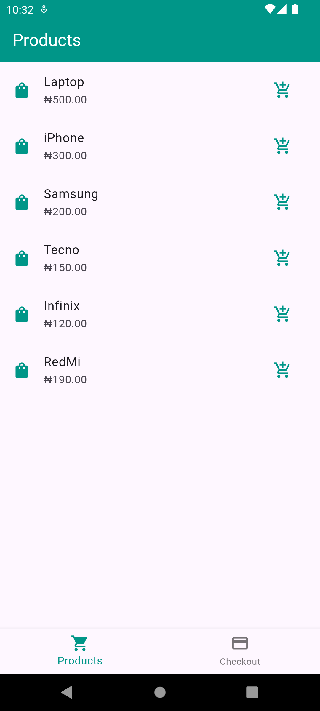
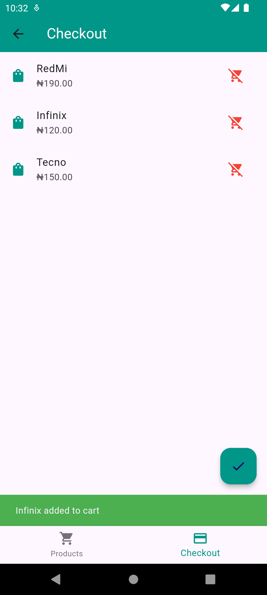
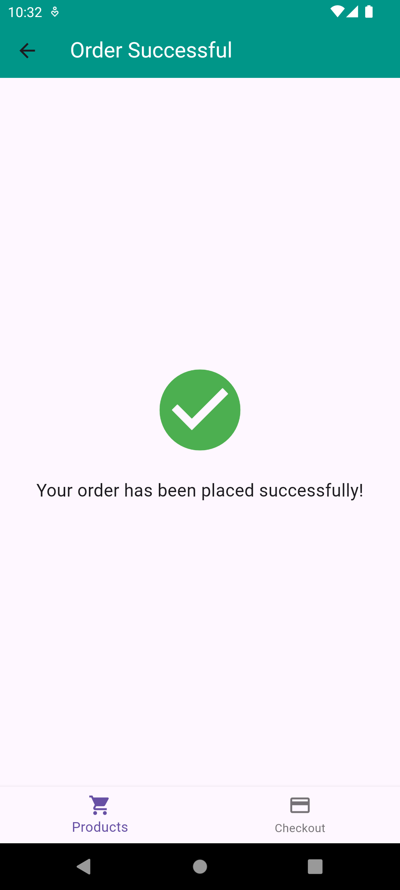

# Simple Shopping App

## Overview
A simple shopping app that displays a list of products and a checkout screen. Users can add and remove items from the checkout and complete their order.

## Features
- List of products
- Add/Remove items to/from checkout
- Order successful screen

## Screenshots




## Setup Instructions
1. Clone the repository:
    ```bash
    git clone https://github.com/ioabdullahi/simple_shop_hng.git
    ```
2. Navigate to the project directory:
    ```bash
    cd simple-shopping-app
    ```
3. Install dependencies:
    ```bash
    flutter pub get
    ```
4. Run the app:
    ```bash
    flutter run
    ```

## Appetize.io Demo
[View Demo](https://appetize.io/app/vcxevczbrh62mafzczveqlktbe?device=pixel7&osVersion=13.0)

## License
This project is licensed under the HNG11 License.
